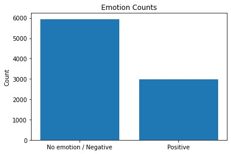
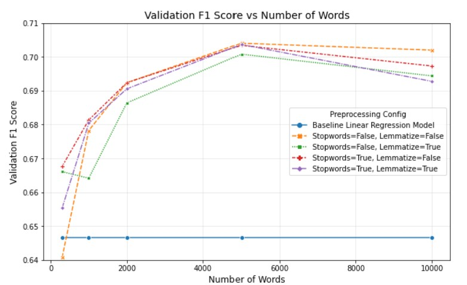

# NLP Product Sentiment

**Author**: [Matt LeRoi](mailto:mcleroi@gmail.com) 

# Overview

Twitter offers a unique opportunity to get the publicly available opinions of a great many people about a wide variety of topics. It is, unfortunately, not organized neatly for easy digestion, and therefore requires analysis to sort, process, and gain useful information from an enormous volume of tweets.

# Business Understanding

A stealth tech company is building a new product. Having failed a previous attempt at covert corporate espionage, they have hired me to gather positive public comments made on Twitter about Google and Apple products to help them understand people's favorite aspects of those products to incorporate them into their new product. The tool will flag tweets as either positive or non-positive (could be neutral or negative) for deeper analysis. The company has stated that they would like to flag as many positive tweets as possible while minimizing false positives (tweets incorrectly labeled as positive).

# Data
A csv file with ~9000 tweets was downloaded from [data.world](https://data.world/crowdflower/brands-and-product-emotions). Each tweet is labeled by a human reviewer as positive, neutral, or negative. ~1/3 are positive and ~2/3 are either neutral or negative. 



## Limitations
The accuracy of these labels is limited by the judgement of the humans who labeled the list, as well as the vagaries of emotion generally. Also, this data's applicability to current technology and current language/slang trends may be limited by the fact that it is now over 10 years old.

# Modeling

The company wants to maximize the number of correctly identified tweets, but also doesn't want to have excessive false positives. Therefore the F1 score has been chosen as the metric by which these models will be judged, as it is a combination metric that takes into account both factors.
I chose to use a TF-IDF vectorizer and logistic regression model as a straightforward first baseline model. The second model is a sequential neural network model. It was built to allow it to be called with varying parameters for tuning and to be used for either a binary or multi-class classification, in case it was necessary to separate positive, neutral, and negative tweets. The number of words captured in the model had an effect on the F1 score, but removing stopwords and lemmatization did not seem to have a consistently significant impact.



# Evaluation / Results

It is time to see the final results! Running the highest performing model (analyzing 5000 words, without removing stopwords or lemmatization) yielded an F1 score of 0.667. This score is generally considered acceptable to moderately good. Given the difficulties even humans have in classifying the emotional content of a message, this seems like a respectable result. The F1 score for the test data on the best model is slightly below the F1 score for the validation data, which is not abnormal. This indicates that the model is not significantly overfit to the validation data, which was used to determine the parameters for the final model. The stealth company now has a pared down list of positive tweets to analyze to glean insights for their new product.

Most positive words for the highest performing model:

cool           
wow            
great          
envy           
makes          
excited        
woot           
hot            
genius         
smart   

## Recommendations

As mentioned above, sentiment in a tweet is hard to determine - by man or machine. The stealth company could have multiple humans reclassify the tweets to ensure greater consistency in the labeled training data, though this would be time-consuming. If they are satisfied with the results of this model, I would be excited to see a further analysis of the most positively associated words to see if any particular features or feelings or sentiments pop up that would lead to insights for their product.

## For More Information

For further details, see the [Jupyter Notebook](./index.ipynb) and [presentation](./presentation.pdf), and for additional info, or just to say hi, contact Matt LeRoi at [mcleroi@gmail.com](mailto:mcleroi@gmail.com)

```
├── data
├── images
├── README.md
├── index.ipynb
└── presentation.pdf
``` 
